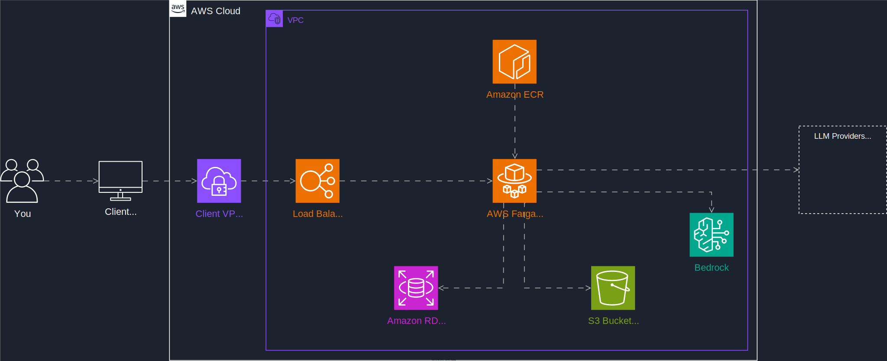

# Attention Is All You Need

This landmark research paper by Vaswani et al. introduced the Transformer architecture, which has become the foundation for most modern large language models.

## Key Contributions

- **Self-Attention Mechanism**: Eliminated the need for recurrent and convolutional layers
- **Parallel Processing**: Enabled faster training compared to RNNs
- **Scalability**: Demonstrated superior performance on translation tasks
- **Architecture Innovation**: Introduced multi-head attention and positional encoding

## Impact

The Transformer architecture has become the backbone of:
- **GPT models** (GPT-3, GPT-4, ChatGPT)
- **BERT and its variants**
- **T5 (Text-to-Text Transfer Transformer)**
- **Modern translation systems**

## Technical Innovation

- **Multi-Head Attention**: Allows the model to focus on different aspects simultaneously
- **Positional Encoding**: Provides sequence order information without recurrence
- **Feed-Forward Networks**: Simple but effective processing layers
- **Layer Normalization**: Stabilizes training of deep networks

## Legacy

This paper fundamentally changed the field of NLP and laid the groundwork for the current AI revolution in language understanding and generation.